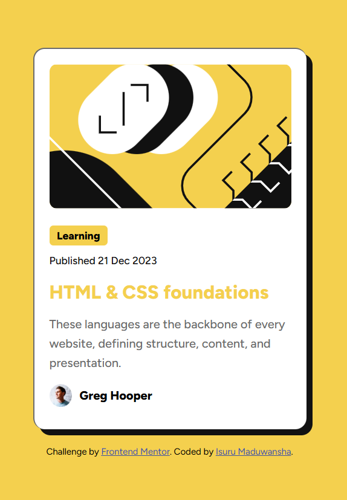

# Frontend Mentor - Blog preview card solution

This is a solution to the [Blog preview card challenge on Frontend Mentor](https://www.frontendmentor.io/challenges/blog-preview-card-ckPaj01IcS). Frontend Mentor challenges help you improve your coding skills by building realistic projects. 

## Table of contents

- [Overview](#overview)
  - [The challenge](#the-challenge)
  - [Screenshot](#screenshot)
  - [Links](#links)
- [My process](#my-process)
  - [Built with](#built-with)
  - [What I learned](#what-i-learned)
  - [Continued development](#continued-development)
  - [Useful resources](#useful-resources)
- [Author](#author)
- [Acknowledgments](#acknowledgments)

## Overview

### The challenge

Users should be able to:

- See hover and focus states for all interactive elements on the page

### Screenshot



### Links

- Solution URL: [Solution URL here](https://github.com/Isuru-Maduwansha/isuru-maduwansha.github.io)
- Live Site URL: [Live site URL here](https://isuru-maduwansha.github.io/)

## My process

### Built with

- Semantic HTML5 markup
- CSS custom properties
- Flexbox
- CSS Grid

### What I learned

I learned about creating custom CSS properties and how to work with them. I also learned about the :root pseudo-class, which has improved my HTML and CSS knowledge.

```css
:root{
   --font-base : "Figtree";
   --c-yellow : hsl(47, 88%, 63%);
   --c-white : hsl(0, 0%, 100%);
   --c-gray500 : hsl(0, 0%, 42%);
   --c-gray950 : hsl(0, 0%, 7%);
}
```

### Continued development

I'll rebuild this with what I learn in futuer.

## Author

- Frontend Mentor - [@Isuru Maduwansha](https://www.frontendmentor.io/profile/Isuru-Maduwansha)
